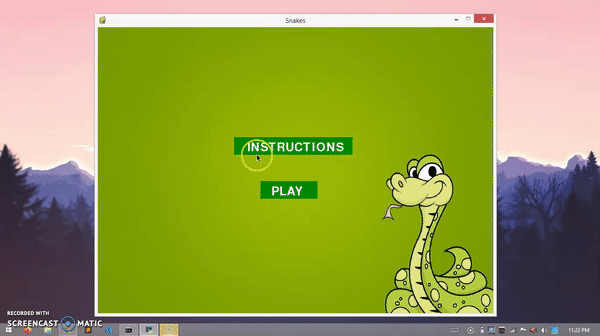

# Snakes

Classical snake game :snake: built using Pygames. 
 
 ## Install dependency using
 
 ```
 pip install pygame
 ```
 
 ## Command to run the app
 
 ```
 python snakegame.py
```
## How to play

1. You can refer to the instructions :scroll:.
2. Press any arrow key :arrow_up: :arrow_down: :arrow_right: :arrow_left: to start the game.
3. Try to eat maximum food :apple: and avoid colliding the wall or the snake body.
5. The snake's color and speed changes on eating the food and score increases by 10.
 
## Demo


